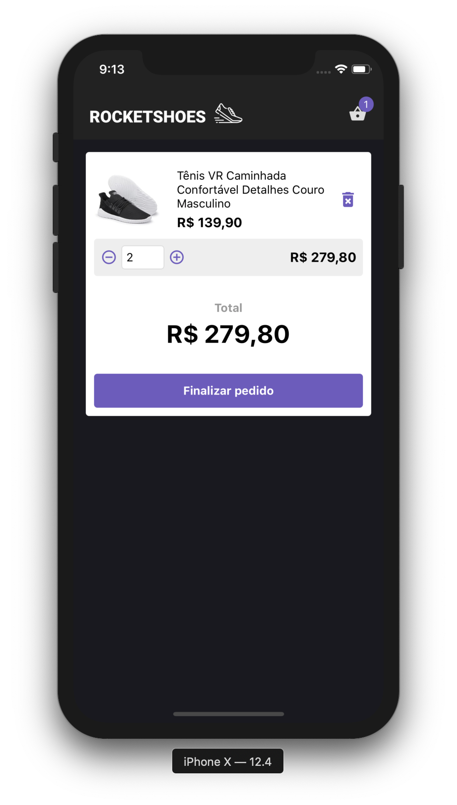
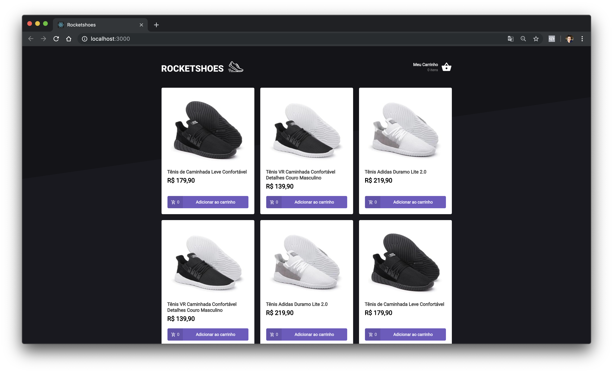
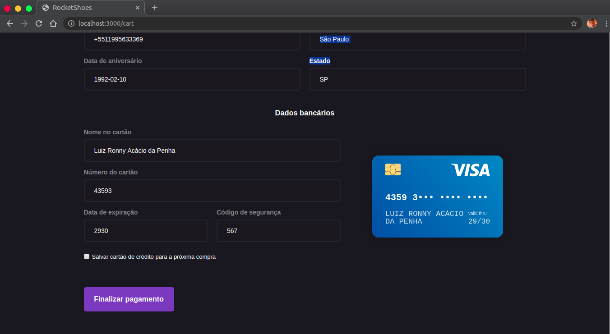

<h1 align="center">
    
</h1>

## 💻 Projeto

O RocketShoes é uma aplicação de e-commerce de tênis, utiliza um frontend trabalho em cima da arquitetura flux utilizando redux e ainda mais usei a api do pagarme para realizar uma transação falsa utilizando cartões de creditos reais. Além disso visa aumentar as minhas habilidades como programador web, principalmente na área da arquitetura flux e transações bancárias.

|                         |                      |
| ----------------------- | -------------------- |
|  |  |  |

## ⚡ Tecnologias

Esse projeto foi desenvolvido com as seguintes tecnologias:

- [Node.js](https://nodejs.org/en/)
- [React](https://reactjs.org)
- [React Native](https://facebook.github.io/react-native/)
- [Expo](https://expo.io/)
- [Redux](https://redux.js.org/)
- [Styled-Components](https://www.styled-components.com/)
- [Pagarme API](https://docs.pagar.me/docs/overview-principal)
- [React Credit Cards](https://github.com/amarofashion/react-credit-cards)

## 💰 Transação com Pagarme Api

<h1 align="center">
    
</h1>
